# Manual de Usuario - Starlight Cinema

## Introducción
Starlight Cinema consiste en una aplicación web dinámica ofreciendo un amplio catálogo de películas del momento y funciones para satisfacer al cliente.

## Objetivos
- Que el usuario tenga un ambiente comodo al realizar la compra.
- Ayudar a la empresa optimizando el sistema siendo mejor opcion que otros.

## Descripción de la Aplicación
Starlight Cinemas es un sistema de reservacion de boletos desde la comododidad del usuario que facilita la compra y reserva de este.

## Tipos de Usuario
1. **Usuario**: Podra visualizar las peliculas pero no podra comprar.
2. **Uusario Cliente**:podra realizar las funciones de un usuario normal con la diferencia que podra comprar los boletos.
3. **Usuario Administrador**: Podra visualizar los usuarios ingresados, Podra eliminar y agregar administradores secundarios como peliculas.

## Registro e Inicio de Sesión

### Inicio de Sesión
- **Correo**
- **Contraseña**
  
### Registro de Usuario
- **Nombre**
- **Correo Electrónico**
- **Contraseña**
- **Confirmar Contraseña**
  
### Registro de Compras
- **Nombre**
- **Correo electronico**
- **Pelicula**
- **Horario**
- **Sala**
- **NIT**
- **Numero de trajeta**
- **Fecha de Expiracion**
- **CVV**
  
## Requisitos Técnicos
1. Starlight Cinema debe tener backend, frontend y gestor de datos con MYSQL.
2. Acceso a un sitio web.
3. Internet para la facturacion.

## Uso de la Aplicación
### Acceso y Registro
1. **Inicio de sesión**: Ingrese su correo electrónico y contraseña.
2. **Registro de nuevo usuario**: Complete el formulario de registro con los datos solicitados.

### Gestión de Usuarios
1. **Administrador**: Puede agregar o eliminar usuarios y administradores secundarios.

## Capturas de Pantalla y Descripción
Proporcione capturas de pantalla de las principales funcionalidades y descripciones detalladas para guiar a los usuarios en el uso de la aplicación.
1. **Pagina principal**
   
   - Carusel sobre las peliculas que estan disponibles.
   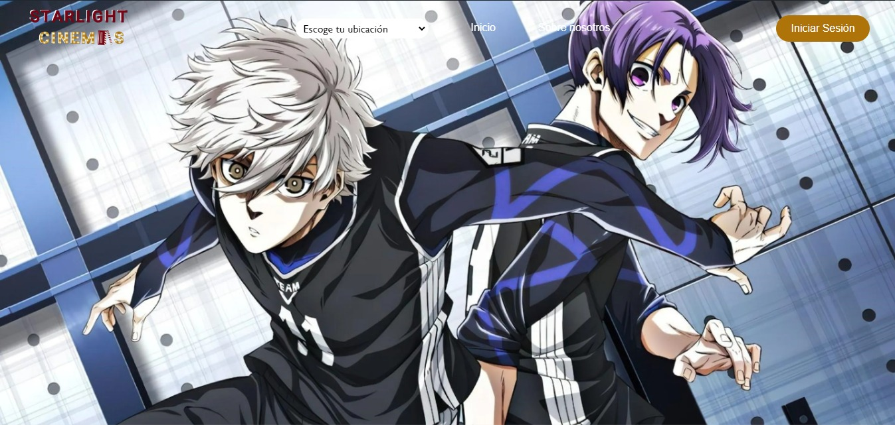
   
   - Cartelera en la cual se muestra las peliculas que pueden escoger. 
   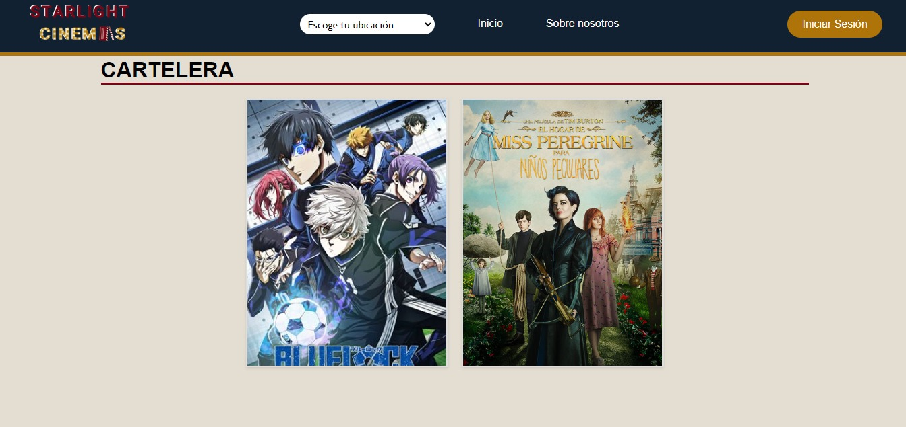

   - Se muestran las ubicaciones en las cuales estan nuestro cine.
   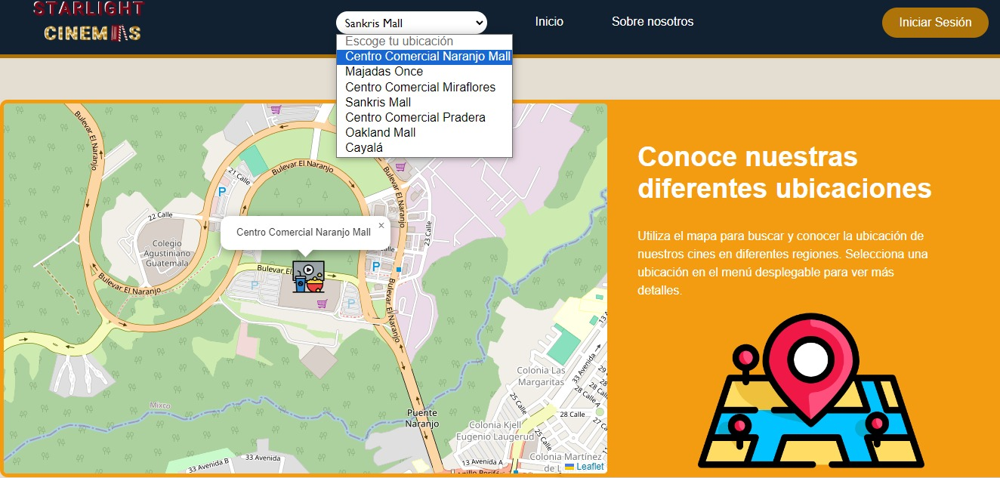

   - Visualización de la misión y visión de nuestro proyecto.
   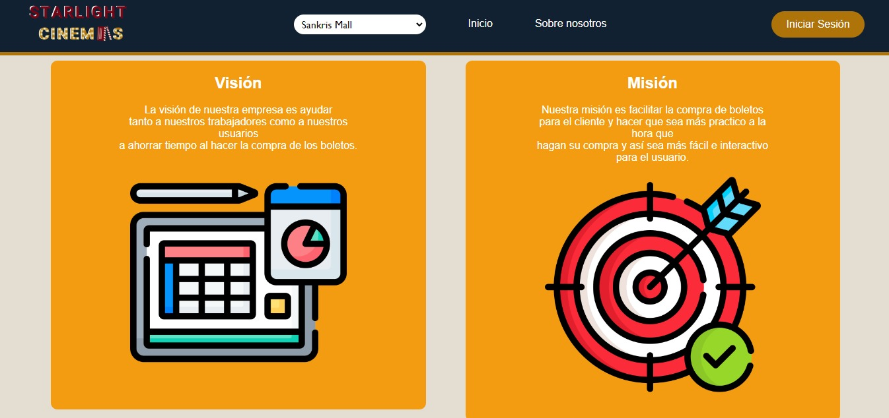

   - visualización del pie de pagina donde se muestra las redes sociales y el logo.
   
   
3. **Pagina sobre nosotros**
   - Explicación de el proposito del proyecto.  
   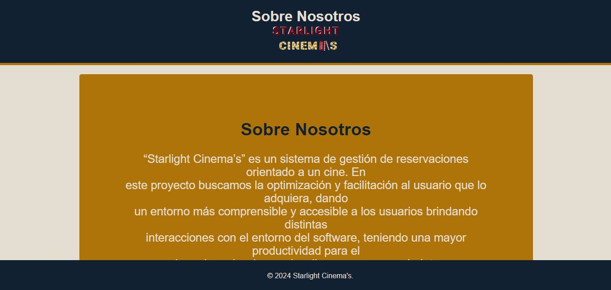

5. **Login**
   
   - Podemos ingresar como usuario o registrarse.
   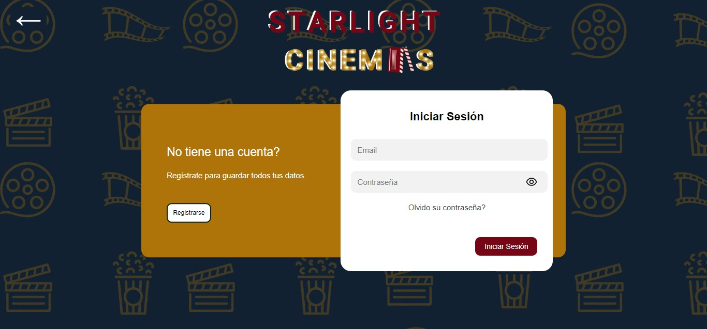

7. **Pagina compra**
   
   - Escogemos la pelicula desea y precionamos el boton de compra.
    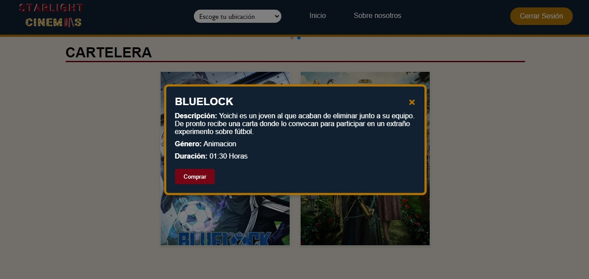

   - Llenamos los campos requeridos para realizar la compra. 
    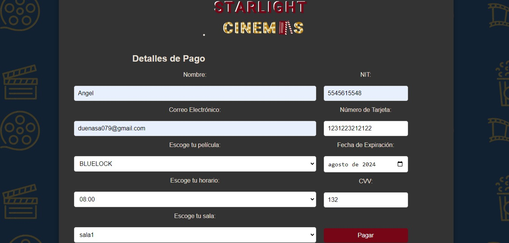

   - Seleccion de los asientos que desee el usuario. 
    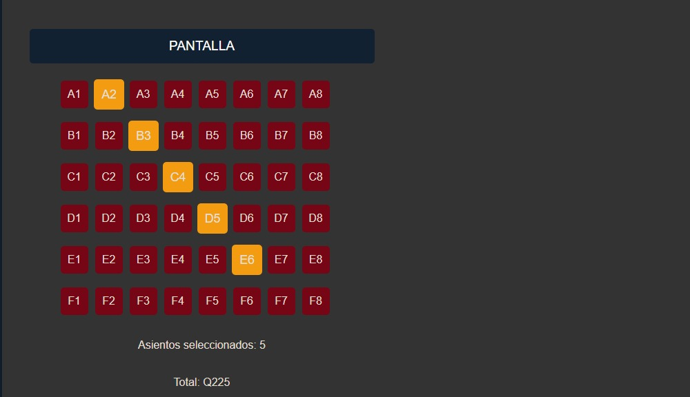

   - Confirmacion de la compra con exito.
    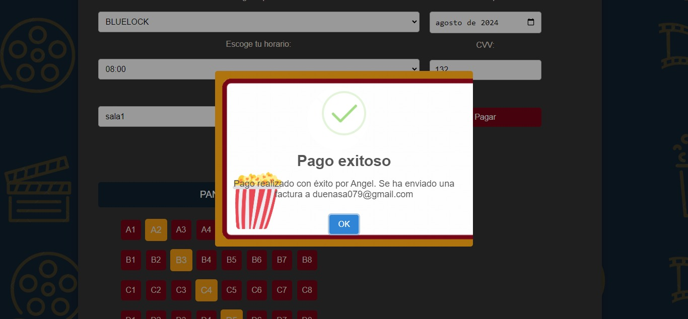

9. **Pagina facturaciòn**

   - Visualizacion de la factura que se le envia al usuario.
    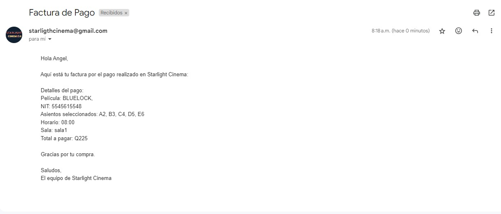

11. **Pagina vista administrador**

    - Interfaz para agregar, eliminar y modificar las peliculas.
    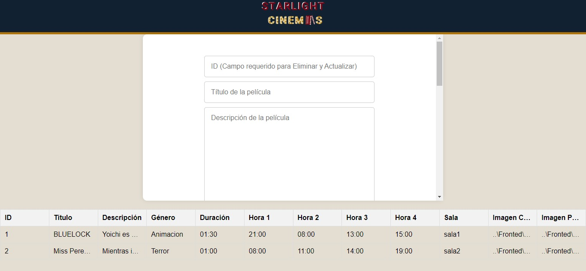

    - interfaz para agregar, eliminar administradores secundarios. 
    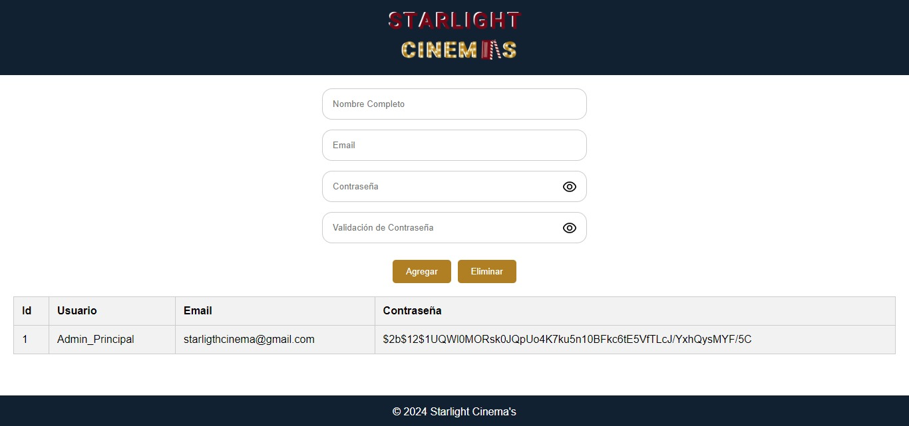

    - Visualización de los usuarios Agregados.
    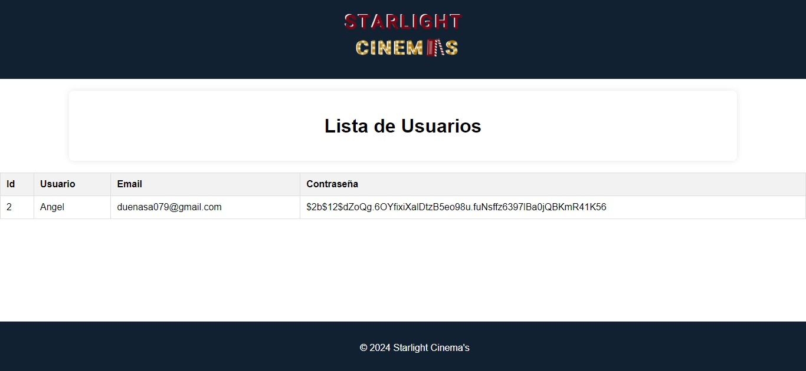
